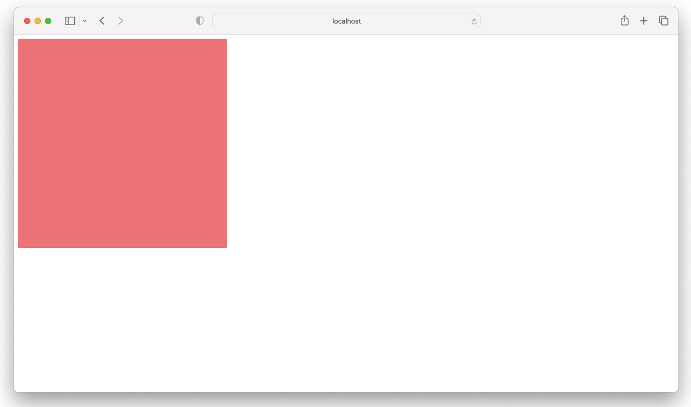

# Emscripten OpenGL + GLWF Demo

## macOS

```shell
piper
cd BazelDemos/intermediate/Cpp/EmscriptenGL/
bazel build --config=macos -- //:index-wasm
bazel_genfiles=$(bazel info bazel-genfiles)
sudo cp index.html $bazel_genfiles/index-wasm/index.html # sudo
cd $bazel_genfiles/index-wasm/
python3 -m http.server
```



## References

- https://blog.feather.systems/WebGL.html
- https://medium.com/cyberbotics/porting-a-c-rendering-engine-to-webassembly-9c32d76c31f1
