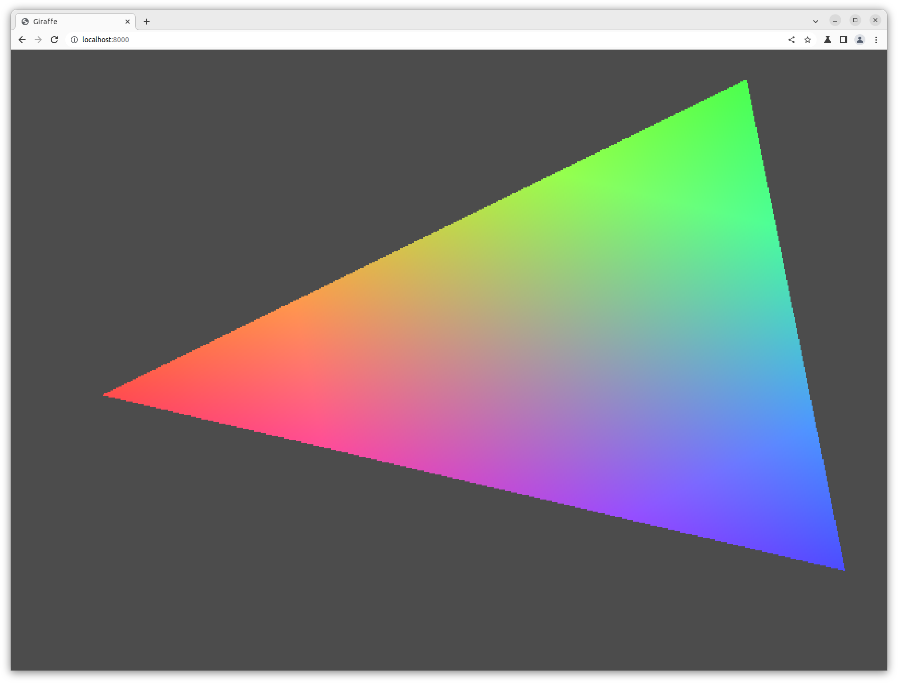

<!--
SPDX-FileCopyrightText: 2022 Julian Amann <dev@vertexwahn.de>
SPDX-License-Identifier: Apache-2.0
-->

# How to run

## Ubuntu 22.04

Chrome Version 104 supports WebGPU on macOS, but not Ubuntu 22.04.
Therefore Chrome Canary has to be used.

```shell
sudo apt install google-chrome-unstable
google-chrome-unstable --enable-unsafe-webgpu --enable-features=Vulkan,UseSkiaRenderer
```

### Start Web-Backend

```shell
cd ${HOME}/dev/Piper/BazelDemos/intermediate/cpp/DawnDemo
bazel build --config=gcc11 -- //:index-wasm
bazel_genfiles=$(bazel info bazel-genfiles)
cd $bazel_genfiles/index-wasm
sudo cp ${HOME}/dev/Piper/BazelDemos/intermediate/cpp/DawnDemo/index.html index.html
python3 -m http.server
```

### Start GLWF-Backend

```shell
bazel run --config=gcc11 //:DawnDemoGlfw
```

## macOS

### Start Web-Backend

```shell
cd ${HOME}/dev/Piper/BazelDemos/intermediate/cpp/DawnDemo
bazel build --config=macos -- //:index-wasm
bazel_genfiles=$(bazel info bazel-genfiles)
cd $bazel_genfiles/index-wasm
sudo cp ${HOME}/dev/Piper/BazelDemos/intermediate/cpp/DawnDemo/index.html index.html
python3 -m http.server
```

# Screenshots




### Start GLWF-Backend

```shell
bazel run --config=macos //:DawnDemoGlfw
```

# Legal Notes

This project contains code files copied from https://github.com/google/skia which is available under the BSD-3-Clause license. See file `LICENSE.skia`. The following files where copied from the skia project:

- `bazel/dawn.BUILD`
- `bazel/spirv_cross.BUILD`
- `bazel/vulkan_headers.BUILD`
- `bazel/vulkan_tools.BUILD`
- `requirements.txt`

This project contains code files copied from https://github.com/cwoffenden/hello-webgpu which is available under the Creative Commons Zero license (or Public Domain, whichever is applicable in your jurisdiction) license:

- `ems/webgpu.cpp`
- `ems/window.cpp`
- `qt/webgpu.cpp`
- `main.cpp`
- `webgpu.h`
- `window.h`

Modification done to this files are available under the same license that the file had before modification.

# References

- https://eliemichel.github.io/LearnWebGPU/getting-started/hello-webgpu.html
- https://cohost.org/mcc/post/1406157-i-want-to-talk-about
- https://developer.chrome.com/blog/webgpu-cross-platform/
- https://github.com/beaufortfrancois/webgpu-cross-platform-app
