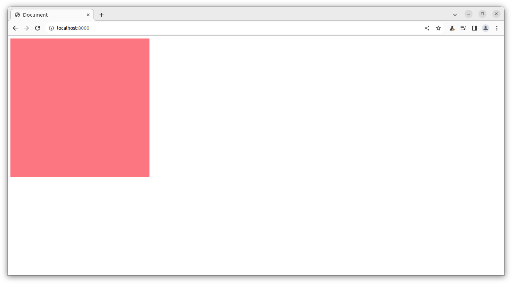
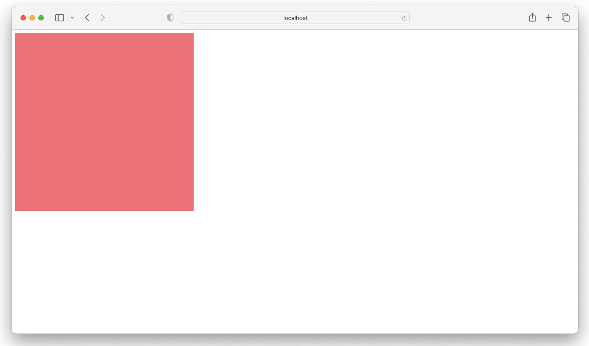

# Emscripten OpenGL Demo

> Note: This demo is based on the blog post
 "WebGL with Emscripten: The Bare Minimum"
 which can be found at https://blog.feather.systems/WebGL.html

## Windows 10/11

```powershell
bazel build --config=gcc11 -- //:emscripten_webgl_demo_archive # config gcc11 is intended here
$bazel_genfiles = (bazel info bazel-genfiles)
Copy-Item "$bazel_genfiles/emscripten_webgl_demo_archive.tar" -Destination "emscripten_webgl_demo_archive.tar"
mkdir serve
& "C:\Program Files\7-Zip\7z.exe" x "emscripten_webgl_demo_archive.tar" -o"serve"
cd serve
python3 -m http.server
```

OR

```shell
bazel build --config=gcc11 -- //:index-wasm
$bazel_genfiles = Invoke-Expression "bazel info bazel-genfiles"
cp -Force index.html $bazel_genfiles/index-wasm/index.html
cd $bazel_genfiles/index-wasm/
python3 -m http.server
```

## Ubuntu 22.04

```shell
bazel build --config=gcc11 -- //:index_wasm
bazel_genfiles=$(bazel info bazel-genfiles)
sudo cp index.html $bazel_genfiles/index_wasm/index.html # sudo required!
cd $bazel_genfiles/index_wasm/
python3 -m http.server
```



## macOS

```shell
bazel build --config=macos -- //:index_wasm
bazel_genfiles=$(bazel info bazel-genfiles)
sudo cp index.html $bazel_genfiles/index_wasm/index.html # sudo required!
cd $bazel_genfiles/index_wasm/
python3 -m http.server
```



## References

- [WebGL with Emscripten: The Bare Minimum](https://blog.feather.systems/WebGL.html)
- [Porting a C++ Rendering Engine to WebAssembly](https://medium.com/cyberbotics/porting-a-c-rendering-engine-to-webassembly-9c32d76c31f1)
