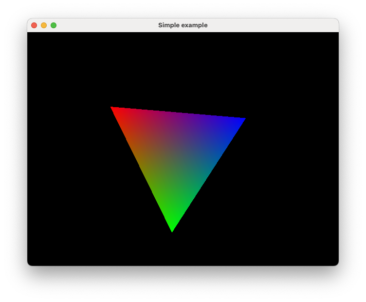
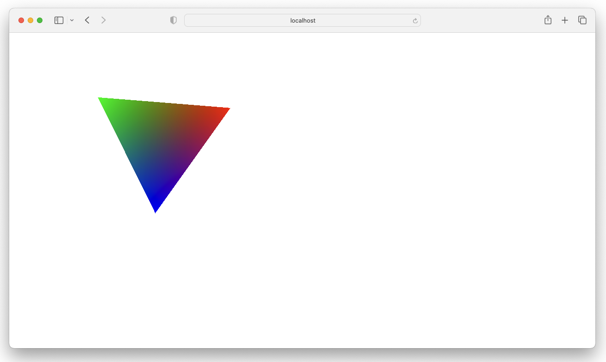

# Emscripten OpenGL+GLFW Demo

## Quick start

### macOS

#### Desktop

```shell
bazel run --config=macos //:main
```



#### Web

```shell
bazel build --config=macos -- //:index-wasm
bazel_genfiles=$(bazel info bazel-genfiles)
sudo cp index.html $bazel_genfiles/index-wasm/index.html # sudo
cd $bazel_genfiles/index-wasm/
python3 -m http.server
```



### Ubuntu 22.04

#### Desktop

```shell
bazel run --config=gcc11 //:main
```

#### Web

```shell
bazel build --config=gcc11 -- //:index-wasm
bazel_genfiles=$(bazel info bazel-genfiles)
sudo cp index.html $bazel_genfiles/index-wasm/index.html # sudo
cd $bazel_genfiles/index-wasm/
python3 -m http.server
```

### Windows

#### Desktop

```shell
bazel run --config=vs2022 //:main
```


#### Web

```shell
bazel build --config=gcc11 -- //:index-wasm
$bazel_genfiles = Invoke-Expression "bazel info bazel-genfiles"
cp -Force index.html $bazel_genfiles/index-wasm/index.html
cd $bazel_genfiles/index-wasm/
python3 -m http.server
```


## Building & Testing

### macOS

#### CLion

```
directories:
  .

derive_targets_from_directories: true

targets:
  # If source code isn't resolving, add additional targets that compile it here

additional_languages:
  python

build_flags:
  --config=macos
```
