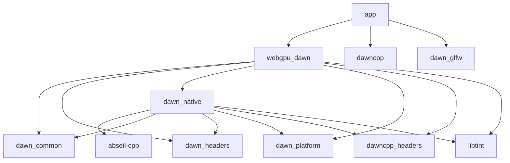

# Dawn for Bazel on Windows

https://developer.chrome.com/blog/webgpu-cross-platform/
https://github.com/beaufortfrancois/webgpu-cross-platform-app


### Web

```shell
bazel build --config=gcc11 -- //:index-wasm
bazel_genfiles=$(bazel info bazel-genfiles)
sudo cp index.html $bazel_genfiles/index-wasm/index.html
cd $bazel_genfiles/index-wasm/
python3 -m http.server
```


1. Goal:

Should run on Windows and look like this:
Do not modify `main.cpp`



